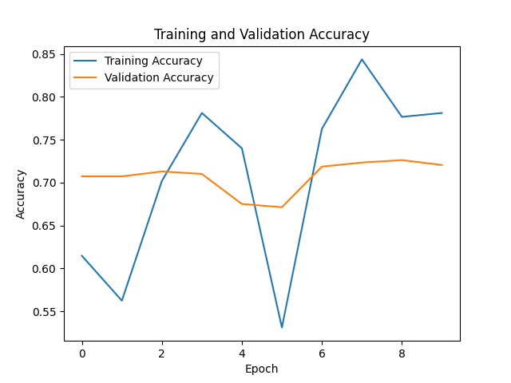

<div align="center">

# 👔 WardrobeWizard

### AI-Powered Digital Wardrobe Management

[](https://python.org)
[](https://djangoproject.com)
[](https://tensorflow.org)
[](https://getbootstrap.com)
[](LICENSE)

**Transform your physical wardrobe into an intelligent digital closet with automatic clothing classification and personalized outfit recommendations.**

[Features](#-features) •
[Demo](#-demo) •
[Installation](#-installation) •
[Usage](#-usage) •
[API](#-api-endpoints) •
[Contributing](#-contributing)

</div>

---

## 📋 Table of Contents

- [About](#-about)
- [Features](#-features)
- [Demo](#-demo)
- [Technology Stack](#-technology-stack)
- [Installation](#-installation)
- [Usage](#-usage)
- [Project Structure](#-project-structure)
- [API Endpoints](#-api-endpoints)
- [Machine Learning Model](#-machine-learning-model)
- [Contributing](#-contributing)
- [License](#-license)
- [Acknowledgements](#-acknowledgements)

---

## 🎯 About

WardrobeWizard is a Django-based web application that empowers users to digitize their physical wardrobes through photo uploads. It leverages machine learning to automatically categorize clothing items and generates personalized outfit recommendations based on your existing wardrobe.

### 🎯 Problem Statement

Managing a wardrobe can be overwhelming—people often forget what they own, struggle with outfit coordination, and underutilize items they've purchased.

### 💡 Solution

WardrobeWizard provides:
- **Automated Organization**: Upload photos and let AI categorize your clothes
- **Smart Recommendations**: Get outfit suggestions based on style compatibility
- **Personal Style Archive**: Visual history of all clothing items with wear tracking
- **Time Savings**: Quick outfit planning without physically searching through your closet

---

## ✨ Features

<table>
<tr>
<td width="50%">

### 📸 Smart Upload & Classification
- Drag-and-drop image upload
- Multi-file batch upload support
- AI-powered automatic categorization (18 categories)
- Confidence score display for classifications

</td>
<td width="50%">

### 👗 Wardrobe Management
- Visual gallery of all clothing items
- Filter by category
- Edit item details and categories
- Soft delete with archive capability

</td>
</tr>
<tr>
<td width="50%">

### 🎨 Outfit Recommendations
- Intelligent outfit pairing algorithm
- Color and style compatibility matching
- Save favorite outfit combinations
- Occasion and season filtering

</td>
<td width="50%">

### 📊 Analytics & Insights
- Wardrobe statistics dashboard
- Wear tracking and logging
- Category breakdown charts
- Most/least worn items identification

</td>
</tr>
<tr>
<td width="50%">

### 👤 User Management
- Secure registration and authentication
- Personal profile with wardrobe overview
- Session management
- Password protection

</td>
<td width="50%">

### 📱 Modern UI/UX
- Mobile-responsive design
- Bootstrap 5 styling
- Intuitive navigation
- Real-time feedback with messages

</td>
</tr>
</table>

---

## 🖼️ Demo

### ML Model Performance

The custom-trained MobileNetV2 model achieves strong classification accuracy:

<div align="center">

</div>

### Supported Clothing Categories

The ML model classifies items into **18 categories**:

| Tops | Bottoms | Outerwear | Other |
|------|---------|-----------|-------|
| T-Shirt | Pants | Outwear | Dress |
| Shirt | Shorts | Blazer | Shoes |
| Polo | Skirt | Hoodie | Hat |
| Top | | | Body |
| Blouse | | | |
| Longsleeve | | | |
| Undershirt | | | |

---

## 🛠️ Technology Stack

### Backend
| Technology | Purpose |
|------------|---------|
| **Django 5.1** | Web framework |
| **SQLite** | Database (PostgreSQL ready) |
| **TensorFlow 2.19** | Machine learning framework |
| **Keras** | Deep learning API |
| **MobileNetV2** | Pre-trained CNN for transfer learning |

### Frontend
| Technology | Purpose |
|------------|---------|
| **Django Templates** | Server-side rendering |
| **Bootstrap 5** | CSS framework |
| **Crispy Forms** | Form styling |

### ML/Data Science
| Technology | Purpose |
|------------|---------|
| **NumPy** | Numerical operations |
| **Pandas** | Data manipulation |
| **Pillow** | Image processing |
| **OpenCV** | Computer vision utilities |
| **scikit-learn** | Model evaluation |

---

## 🚀 Installation

### Prerequisites

- Python 3.10 or higher
- pip (Python package manager)
- Git
- Virtual environment (recommended)

### Step-by-Step Setup

1. **Clone the repository**
   ```bash
   git clone https://github.com/NowarkCodes/WardrobeWizard.git
   cd WardrobeWizard
   ```

2. **Create and activate a virtual environment**
   ```bash
   # On macOS/Linux
   python -m venv venv
   source venv/bin/activate

   # On Windows
   python -m venv venv
   venv\Scripts\activate
   ```

3. **Install dependencies**
   ```bash
   pip install -r requirements.txt
   ```

4. **Apply database migrations**
   ```bash
   python manage.py migrate
   ```

5. **Create a superuser (optional, for admin access)**
   ```bash
   python manage.py createsuperuser
   ```

6. **Run the development server**
   ```bash
   python manage.py runserver
   ```

7. **Access the application**
   
   Open your browser and navigate to: `http://127.0.0.1:8000`

---

## 📖 Usage

### Getting Started

1. **Register an Account**
   - Navigate to the registration page
   - Create an account with username and password

2. **Upload Your First Item**
   - Click "Upload" from the menu
   - Select one or more clothing photos
   - The AI will automatically classify each item

3. **View Your Wardrobe**
   - Browse your digital wardrobe in the gallery view
   - Filter by category to find specific items
   - Click on items to see details and recommendations

4. **Get Outfit Recommendations**
   - View AI-generated outfit pairings
   - Save your favorite combinations
   - Track what you wear

### Quick Commands

```bash
# Run development server
python manage.py runserver

# Create database migrations
python manage.py makemigrations

# Apply migrations
python manage.py migrate

# Create superuser for admin panel
python manage.py createsuperuser

# Access admin panel
# Navigate to: http://127.0.0.1:8000/admin
```

---

## 📁 Project Structure

```
WardrobeWizard/
├── WardrobeWizard/           # Django project settings
│   ├── __init__.py
│   ├── settings.py           # Project configuration
│   ├── urls.py               # Root URL configuration
│   ├── wsgi.py               # WSGI entry point
│   └── asgi.py               # ASGI entry point
│
├── wardrobe/                 # Main application
│   ├── migrations/           # Database migrations
│   ├── templates/wardrobe/   # HTML templates
│   │   ├── dashboard.html    # User dashboard
│   │   ├── upload.html       # Image upload page
│   │   ├── history.html      # Wardrobe gallery
│   │   ├── profile.html      # User profile
│   │   └── ...               # Other templates
│   ├── admin.py              # Admin configuration
│   ├── apps.py               # App configuration
│   ├── forms.py              # Django forms
│   ├── models.py             # Database models
│   ├── urls.py               # App URL patterns
│   ├── views.py              # View functions
│   ├── tests.py              # Unit tests
│   └── custom_fashion_model.h5  # Trained ML model
│
├── templates/                # Base templates
│   ├── base.html             # Base template
│   └── registration/         # Auth templates
│
├── dataset/                  # Training dataset
│   ├── images/               # Training images
│   └── labels/               # Label files
│
├── media/                    # User uploads (gitignored)
├── train_model.py            # Model training script
├── manage.py                 # Django CLI
├── requirements.txt          # Python dependencies
└── README.md                 # This file
```

---

## 🔌 API Endpoints

### Authentication

| Method | Endpoint | Description |
|--------|----------|-------------|
| GET | `/login/` | Login page |
| POST | `/login/` | Authenticate user |
| POST | `/logout/` | Logout user |
| GET/POST | `/register/` | User registration |

### Wardrobe Management

| Method | Endpoint | Description |
|--------|----------|-------------|
| GET | `/` | Landing page / Dashboard redirect |
| GET | `/dashboard/` | User dashboard with statistics |
| GET | `/menu/` | Navigation menu |
| GET/POST | `/upload/` | Upload new clothing items |
| GET | `/history/` | View wardrobe gallery |
| GET | `/result/<id>/` | View item details |
| GET/POST | `/edit/<id>/` | Edit item details |
| POST | `/delete/<id>/` | Remove item from wardrobe |
| POST | `/worn/<id>/` | Mark item as worn |

### Outfits & Analytics

| Method | Endpoint | Description |
|--------|----------|-------------|
| GET | `/outfits/` | View saved outfits |
| GET/POST | `/outfits/save/` | Create new outfit |
| POST | `/outfits/delete/<id>/` | Delete outfit |
| GET | `/stats/` | Wardrobe statistics |
| GET | `/profile/` | User profile overview |

---

## 🤖 Machine Learning Model

### Architecture

WardrobeWizard uses a **MobileNetV2** convolutional neural network with transfer learning:

```
Model: MobileNetV2 (Pre-trained on ImageNet)
├── Base Model: MobileNetV2 (frozen weights)
├── Global Average Pooling 2D
├── Dense Layer (1024 units, ReLU activation)
└── Output Layer (20 classes, Softmax activation)
```

### Training Configuration

| Parameter | Value |
|-----------|-------|
| Input Size | 224 × 224 × 3 (RGB) |
| Batch Size | 32 |
| Epochs | 25 |
| Optimizer | Adam |
| Loss Function | Categorical Crossentropy |

### Data Augmentation

The training pipeline includes:
- Random rotation (±20°)
- Width/height shifts (±20%)
- Shear transformation
- Zoom (±20%)
- Horizontal flip

### Retraining the Model

To retrain the model with your own dataset:

1. Prepare your dataset in `dataset/images/` with corresponding labels in `dataset/labels/dataset.csv`

2. Run the training script:
   ```bash
   python train_model.py
   ```

3. The new model will be saved as `custom_fashion_model.h5`

4. Move the model to the wardrobe app:
   ```bash
   mv custom_fashion_model.h5 wardrobe/
   ```

---

## 🤝 Contributing

Contributions are welcome! Here's how you can help:

### Getting Started

1. **Fork the repository**
2. **Clone your fork**
   ```bash
   git clone https://github.com/YOUR_USERNAME/WardrobeWizard.git
   ```
3. **Create a feature branch**
   ```bash
   git checkout -b feature/amazing-feature
   ```
4. **Make your changes**
5. **Commit your changes**
   ```bash
   git commit -m "Add amazing feature"
   ```
6. **Push to your branch**
   ```bash
   git push origin feature/amazing-feature
   ```
7. **Open a Pull Request**

### Development Guidelines

- Follow [PEP 8](https://peps.python.org/pep-0008/) style guidelines
- Write meaningful commit messages
- Add tests for new functionality
- Update documentation as needed
- Ensure all tests pass before submitting PR

### Areas for Contribution

- 🐛 Bug fixes
- ✨ New features
- 📝 Documentation improvements
- 🎨 UI/UX enhancements
- 🧪 Test coverage
- 🌐 Internationalization

---

## 📄 License

This project is licensed under the MIT License - see the [LICENSE](LICENSE) file for details.

```
MIT License

Copyright (c) 2026 WardrobeWizard

Permission is hereby granted, free of charge, to any person obtaining a copy
of this software and associated documentation files (the "Software"), to deal
in the Software without restriction, including without limitation the rights
to use, copy, modify, merge, publish, distribute, sublicense, and/or sell
copies of the Software, and to permit persons to whom the Software is
furnished to do so, subject to the following conditions:

The above copyright notice and this permission notice shall be included in all
copies or substantial portions of the Software.
```

---

## 🙏 Acknowledgements

- [Django](https://www.djangoproject.com/) - The web framework for perfectionists with deadlines
- [TensorFlow](https://www.tensorflow.org/) - Machine learning platform
- [MobileNetV2](https://arxiv.org/abs/1801.04381) - Efficient CNN architecture
- [Bootstrap](https://getbootstrap.com/) - CSS framework
- [Fashion-MNIST](https://github.com/zalandoresearch/fashion-mnist) - Inspiration for fashion classification
- [DeepFashion](http://mmlab.ie.cuhk.edu.hk/projects/DeepFashion.html) - Fashion dataset reference

---

<div align="center">

**⭐ Star this repository if you find it helpful!**

Made with ❤️ by the WardrobeWizard Team

[Report Bug](https://github.com/NowarkCodes/WardrobeWizard/issues) •
[Request Feature](https://github.com/NowarkCodes/WardrobeWizard/issues)

</div>
